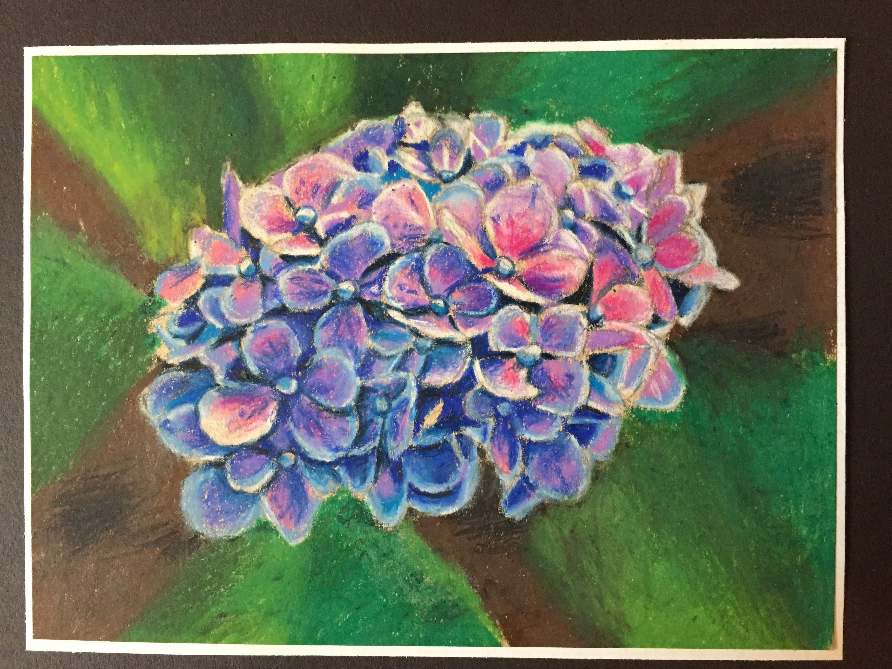
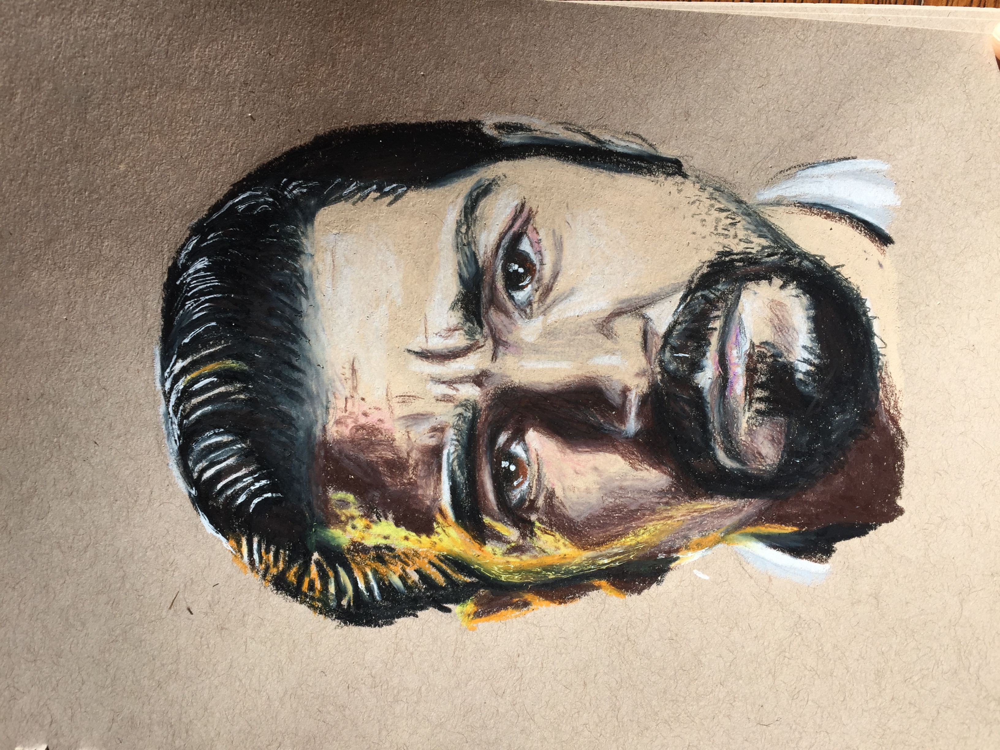
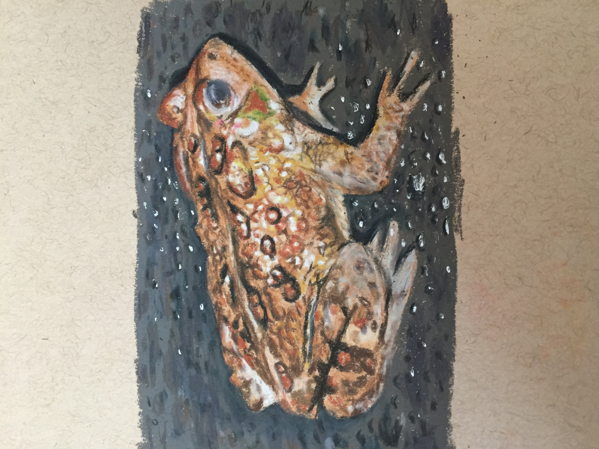
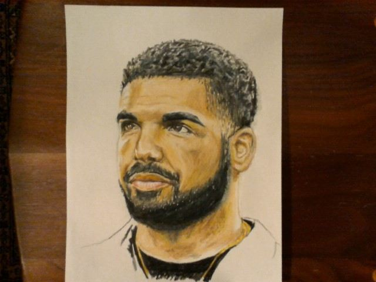
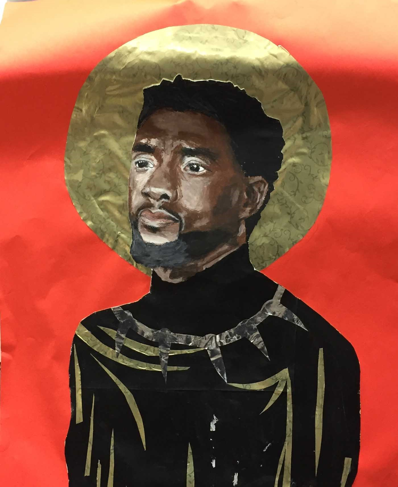

<!DOCTYPE html>
<html>
	<head>
		<title>Andrew's Gallery</title>
    	
	</head>
	<body>
		<h1 class="headers">ANDREW'S GALLERY</h1>
		<h2 class="headers2"><b>INTRO</b></h2>
		
<b>This is a collection of my most recent work. There is no specific theme that unifies all of the pieces. Some focus on a single object while others focus on composition.  My approach to drawing or painting usually revolves around observation, either from life or an original photograph. I alter the image to create a more interesting composition or subject matter. Here, I will likely incorporate some imagination as I move away from the image in front of me. In this way, my focus is not only on realism and detail, but on the overall feeling of the piece.
</b>
	

		
<b>If you try to steal this work and sell it I will be mad. So please don't. Click <a href="https://en.wikipedia.org/wiki/Vincent_van_Gogh">here</a> for my Wikipedia page.</b>
    

		<h2 class=headers></h2>
	 
    	 
    	 
    	 
    	 
    	 
    	 
    	 
    	
    	
    	

	</body>
</html>
